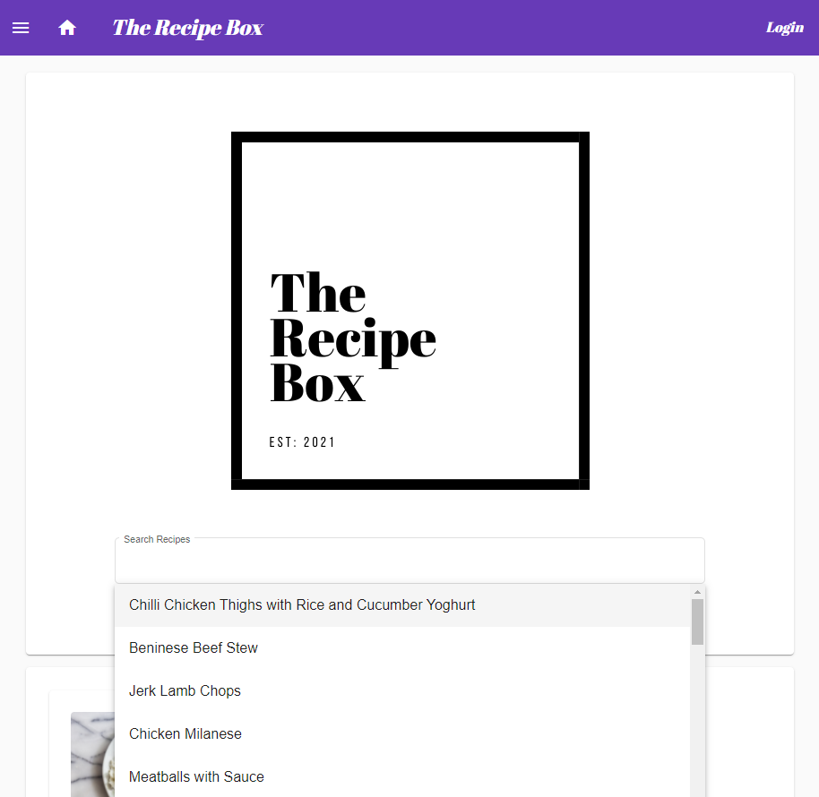
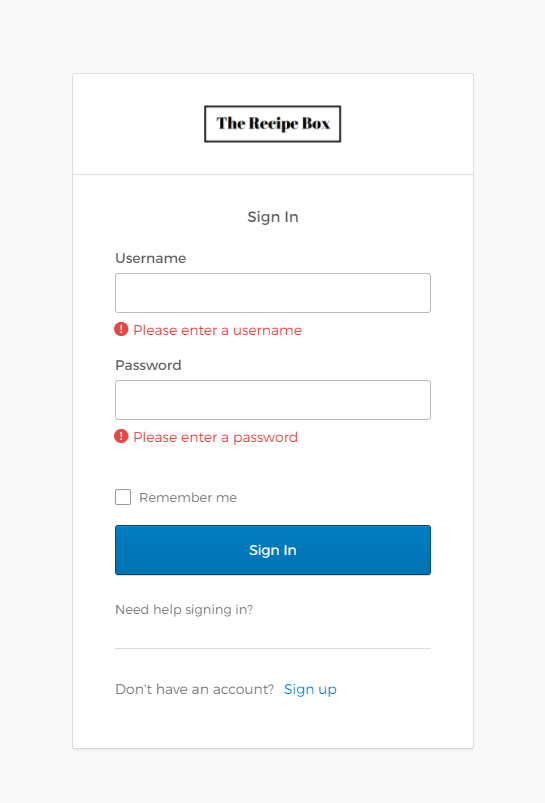
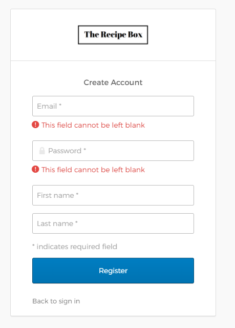
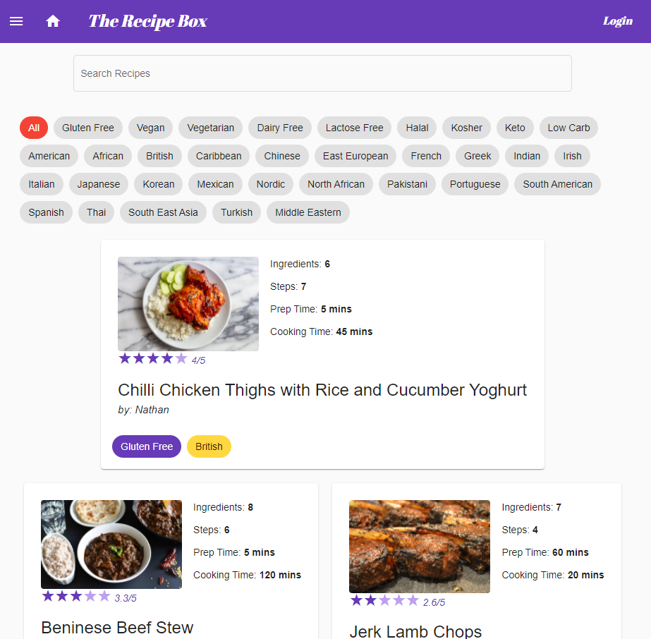
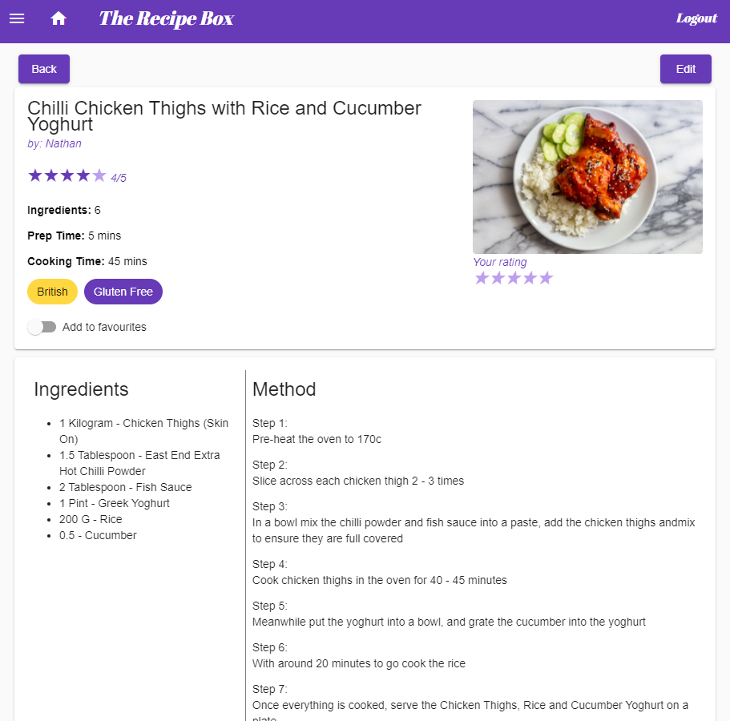
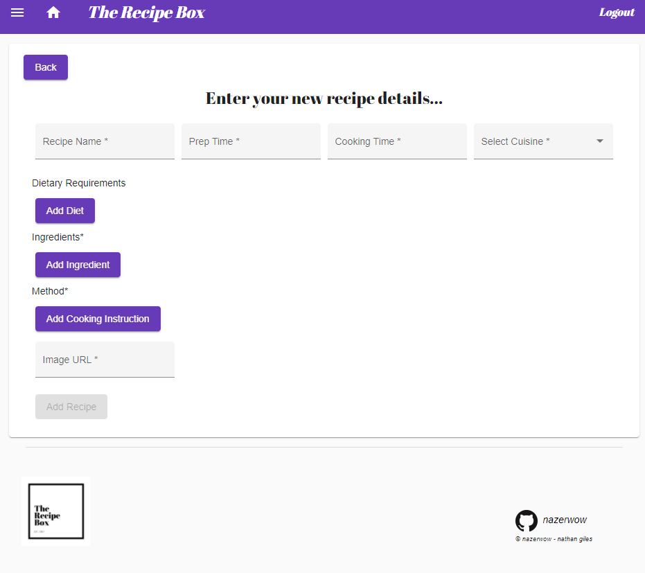

## Table of Contents

1. [**About**](#About)
2. [**Getting started**](#Getting-started)
3. [**API Routes**](#API-routes)
4. [**Images**](#Images)


## About

At the recipe box our aim is to provide a simple and clean recipe app, so you can spend less time scrolling and more
time eating!

The Recipe Box allows you to:

* Search Recipes by Name, Diet or Cuisine

* Add Recipes to your favourites

* Rate Recipes

* Create / Edit / Delete your own recipes

* Our page will also show your our highest rated and most favourited recipes

* Login / Sign Up Using Oauth2 (via Okta) 

The project has been created with a microservices structure to aid with future scalability and the addition of new feature.
Our microservices include:

- Recipe-Service
- Favourites-Service
- Ratings-Service
- User-Service
- Review-Service

## Getting started

### Running The Recipe Box App
<br>

1. Download ZIP file / Clone the project:
```
https://github.com/EN-IH-WDPT-JUN21/nazerwow-final-project-recipe-app.git
```

2. Create mySQL database at the standard localhost port 3306 called "recipeapp"

```
Or use the below commands to Set up database and the same login details as us to save changing this in all microservices 

CREATE DATABASE pokeapp;
CREATE USER 'ironhack-user1'@'localhost' IDENTIFIED BY 'ironhack-user1';
GRANT ALL PRIVILEGES ON *.* TO 'ironhack-user1'@'localhost';
FLUSH PRIVILEGES;

```

3. Set Up & Run The Microservices - (Best Running Order - > Discovery, Gateway, Recipe, User, Favourite, Rating)
```
OPTION 1
=== Using Terminal === 
Create a JAR file for each service using Maven package
Navigate to the target folder for that microservice
Run each Jar File by using JAVA -jar .\{File-name}
eg. JAVA -jar .\recipe-service-0.0.1-SNAPSHOT.jar

=============================

OPTION 2
=== Using Intellij ===
Run Each Microservice Application
```

4. Load Project in Visual Studio enter the following into terminal:

  ```
  cd .\recipe-app-frontend\
  npm install 
  ng serve 
  ```

5. Enjoy at http://localhost:4200/

## API Routes

### recipe-service
Generates, stores and updates SalesRep objects

| Endpoint | Method | Description | Path Params
| :--- | :--- | :--- | :--- 
| /api/v1/recipes | `GET` | Get all recipes | None
| /api/v1/cuisines | `GET` | Get all cuisines | None
| /api/v1/diets | `GET` | Get all diets | None
| /api/v1/measurements | `GET` | Get all measurements | None
| /api/v1/recipes/{id} | `GET` | Get Recipe by id | `id=[Long]`
| /api/v1/recipes/add | `POST` | Add new Recipe | None
| /api/v1/recipes/edit | `PUT` | Update Recipe name |  `recipeDTO=[recipeDTO]`
| /api/v1/recipes/delete/{id} | `DELETE` | Delete Recipe | `id=[Long]`
| /api/v1/recipes/user/{id} | `GET` | Get Recipe By UserId | `id=[Long]`

### user-service
Generates, stores and updates SalesRep objects

| Endpoint | Method | Description | Path Params
| :--- | :--- | :--- | :--- 
| /api/v1/users | `GET` | Get all users | None
| /api/v1/users/{id} | `GET` | Get User by id | `id=[Long]`
| /api/v1/users/{id}/verify | `GET` | Return Boolean for verification | `id=[Long]`
| /api/v1/users/email/{email} | `GET` | Get User by email | `email=[String]`
| /api/v1/users/add | `POST` | Add new User | None
| /api/v1/users/edit | `PUT` | Update User name |  `userDTO=[userDTO]`
| /api/v1/users/delete/{id} | `DELETE` | Delete User | `id=[Long]`
| /api/v1/users/user/{id} | `DELETE` | Get User By UserId | `id=[Long]`
| /api/v1/users/profile | `GET` | Return User Profile | None

### rating-service
Generates, stores and updates SalesRep objects

| Endpoint | Method | Description | Path Params
| :--- | :--- | :--- | :--- 
| /api/v1/ratings | `GET` | Get all ratings | None
| /api/v1/ratings/{userId} | `GET` | Get Rating by userId | `userId=[Long]`
| /api/v1/ratings/{recipeId}/{userId} | `GET` | Boolean Returned - user has Previously rated recipe | `recipeId=[Long]` `userId=[Long]` 
| /api/v1/ratings/recipe/{recipeId}| `GET` | Return average rating for Recipe | `recipeId=[Long]`
| /api/v1/ratings/top10recipes | `GET` | Get top10 rated recipes | None
| /api/v1/ratings/top10recipes/{userId} | `GET` | Get top10 recipes Rated By User | `userId=[Long]`
| /api/v1/ratings/raterecipe | `PUT` | Rate Recipe | `ratingDTO=[ratingDTO]`
| /api/v1/ratings/usersrating | `PUT` | Gets users rating if previously rated recipe | `ratingDTO=[ratingDTO]`

### favourite-service
Generates, stores and updates SalesRep objects

| Endpoint | Method | Description | Path Params
| :--- | :--- | :--- | :--- 
| /api/v1/favourites | `GET` | Get all favourites | None
| /api/v1/favourites/{id} | `GET` | Get Favourite by id| `id=[Long]`
| /api/v1/favourites/userid/{id} | `GET` | Get All RecipeDTO's By UserId | `id=[Long]`
| /api/v1/favourites/recipeisfavourited | `PUT` | Boolean Returned - If User Has Favourited Or Not | `favouriteDTO=[favouriteDTO]`
| /api/v1/favourites/add | `POST` | Add to Favourites | `favouriteDTO=[favouriteDTO]`
| /api/v1/favourites/remove | `PUT` | Remove From Favourites | `favouriteDTO=[favouriteDTO]`
| /api/v1/favourites/top10 | `PUT` | Returns top 10 most favourited RecipeDTO | None


## Images
 Home Page



Login / Sign up <br>
<div>
 
</div>
Recipe Browser (Advanced Search)

Recipe Page

Recipe Form (Dynamic for Add and Edit)


